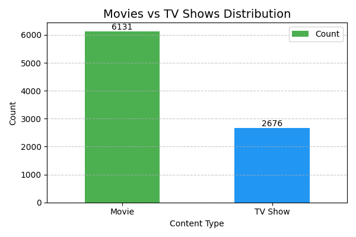
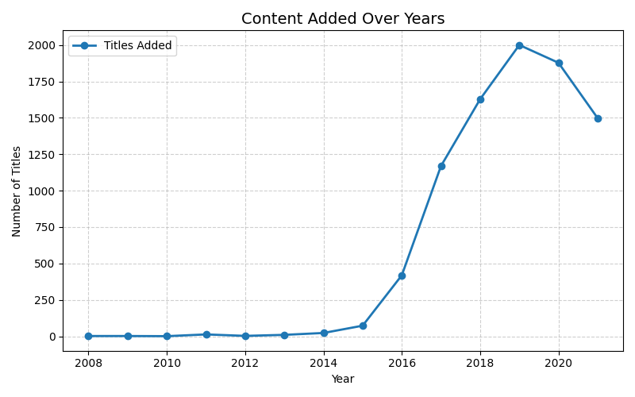
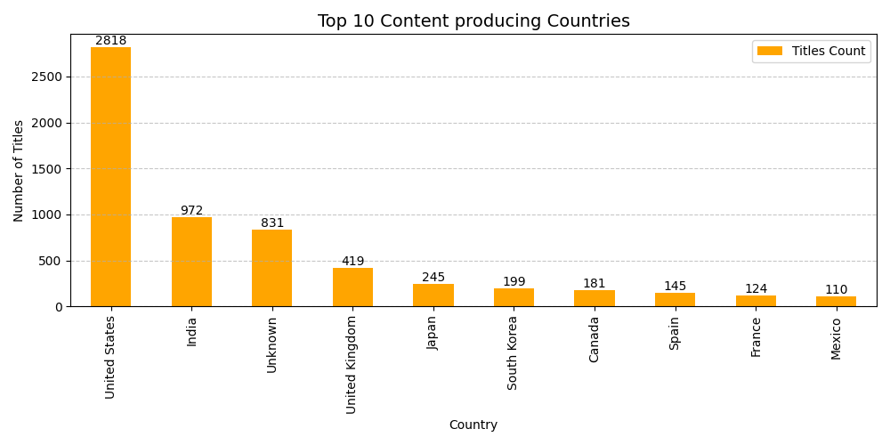
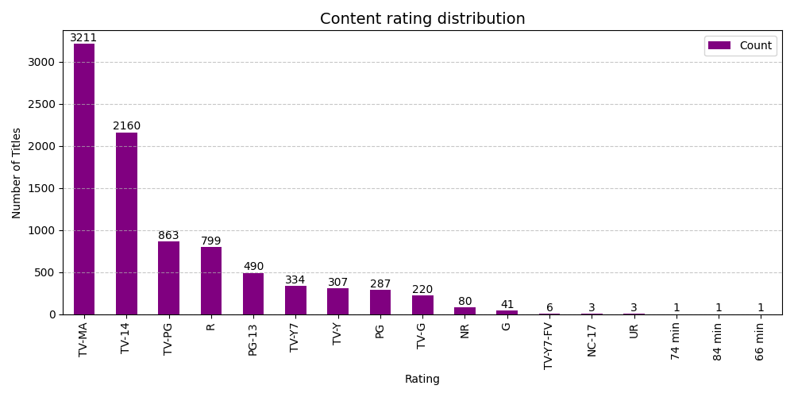

# 🎬 Netflix Data Cleaning & Exploratory Data Analysis

## 📌 Overview
This project focuses on cleaning and analyzing Netflix content data to extract meaningful insights about content distribution, trends, and viewer targeting.

## 💡 Skills Demonstrated

- Data cleaning and preprocessing of real-world datasets
- Handling missing, inconsistent, and unstructured data
- Exploratory data analysis to uncover trends and patterns
- Feature engineering for enhanced data insights
- Data visualization with clear, client-friendly outputs
- Python (Pandas, Matplotlib) for data manipulation and analysis
- Structured project development and documentation

## ❗ Problem Statement
The dataset contains missing values, inconsistent formatting, and unstructured fields, making it unsuitable for direct analysis.

## ✅ Solution
- Handled missing values in key columns
- Standardized text fields
- Converted date columns
- Removed duplicates
- Engineered new features for analysis

## 📦 Deliverables
- Cleaned dataset
- Jupyter Notebook
- Visualizations
- Insights report

## 🛠️ Tools Used
- Python
- Pandas
- Matplotlib

## 📊 Key Insights
- Movies dominate Netflix content compared to TV shows
- Significant growth in content addition after 2015
- USA and India produce the most content
- Most content is targeted toward mature audiences

## 📊 Visual Insights






## ▶️ How to Run

### 1. Clone the repository
git clone https://github.com/kandulajnaneswara/Data_Cleaning_EDA_portfolio.git

### 2. Navigate to Project 2 folder
cd Data_Cleaning_EDA_portfolio/Project\ 2_Netflix_data_cleaning_EDA

### 3. Install required libraries
pip install pandas matplotlib

### 4. Run the script
python source/netflix_eda.py

### 5: View Outputs
- Cleaned dataset → `data/cleaned_netflix.csv`
- Visualizations → `plots/`

## ⚙️ Requirements

- Python 3.x
- pandas
- matplotlib

## 📂 Project Structure
```text
NetFlix_data_cleaning&EDA/
│
├── plots/
│  ├── chart1_content_type_distribution.png
│  └── chart2_content_over_years.png
│  └── chart3_top_content_producing_countries.png
│  └── chart4_content_rating_distribution.png
│
│── data/
|  ├── cleaned_netflix_dataset.csv
│  └── netflix_titles.csv
├── source/
|  ├── netflix_eda.py
└── README.md
